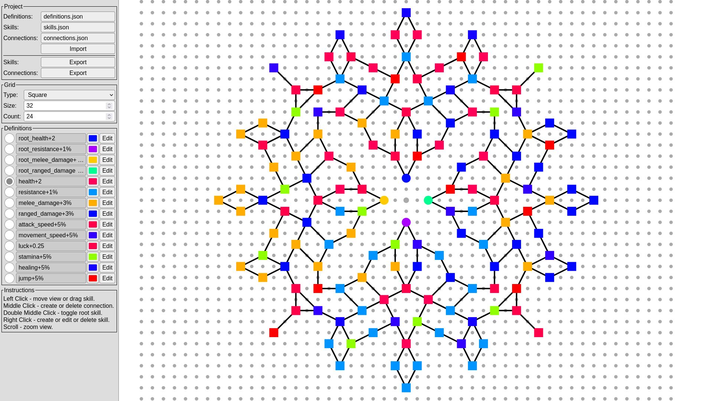

# Editor

Pufferfish's Skills mod has a dedicated tool to edit skills, it can be found [here](https://puffish.net/skillsmod/editor/)

To start using editor you need to import config files.
Select them from disc, for example you can use the default ones generated by the mod.
You can find them in the mod's config directory.

This editor is limited only to designing skills placement and layout.
If you want to add more definitions you need to manually add them to `definitions.json` file before importing to the editor.
You can read more about how to do this [here](/creators/configuration/files/definitions)